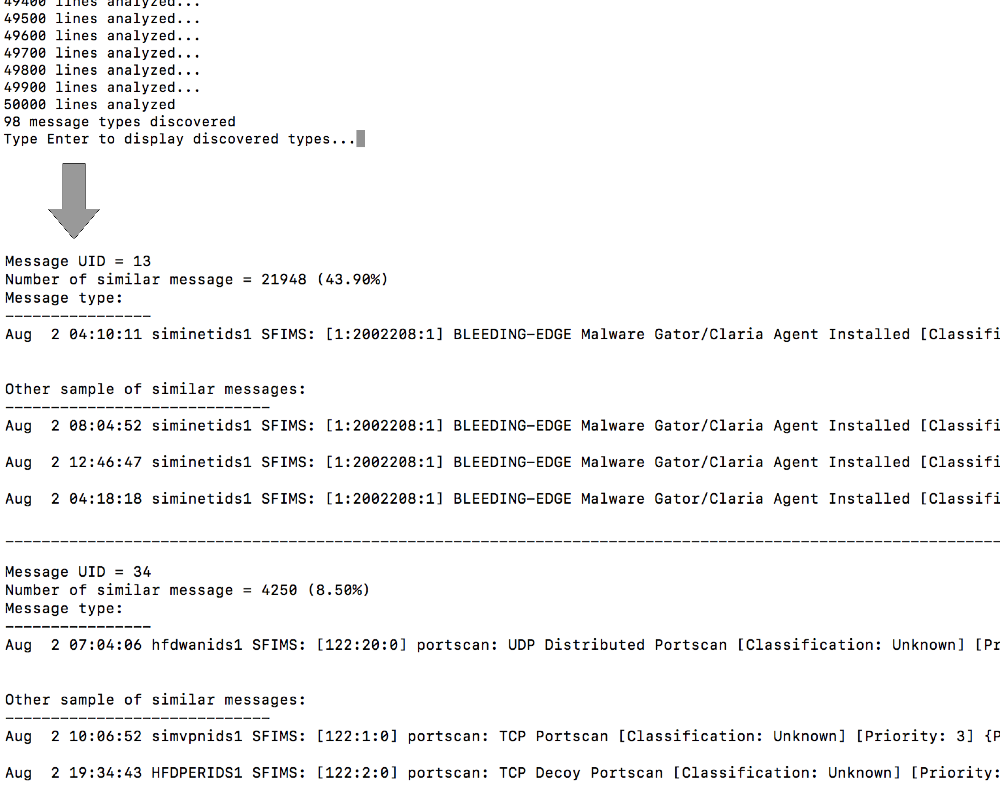

# Logstats
Automated classification of unstructured log records

This Python script can automatically discover message types from sample log files. It supports the Levenshtein distance / distance-ratio and Trend Micro Locality Sensitive Hash (TLSH) methods for measuring the similarity between two sequences.

## Prerequisites
https://pypi.org/project/python-Levenshtein/

https://pypi.org/project/py-tlsh/

## Usage

```
python3 logstats.py -f input.txt -o output.txt -r 0.5 -m distance-ratio -v True
```
For the distance-ratio method, [-r] is the Levenshtein ratio is a value between 0 and 1 used to adjust the granularity of the classification. The higher the ratio is, the more granular will be the classification.

```
python3 logstats.py -f input.txt -o output.txt -r 30 -m distance -v True
```
For the distance method, [-r] is the minimum number of difference to consider the strings similar.

```
python3 logstats.py -f input.txt -o output.txt -r 30 -m tlsh -v True
```
For the tlsh method, [-r] is the minimum TLSH distance to consider the strings similar.

## Example

